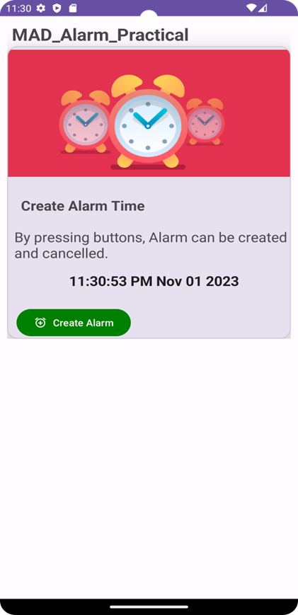
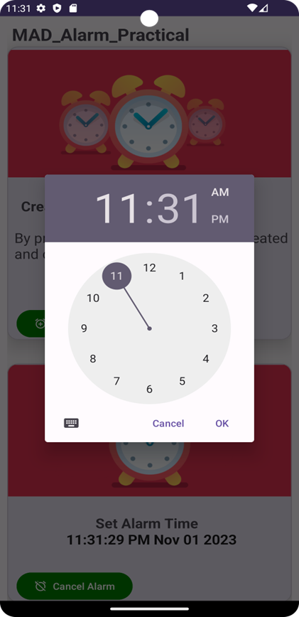
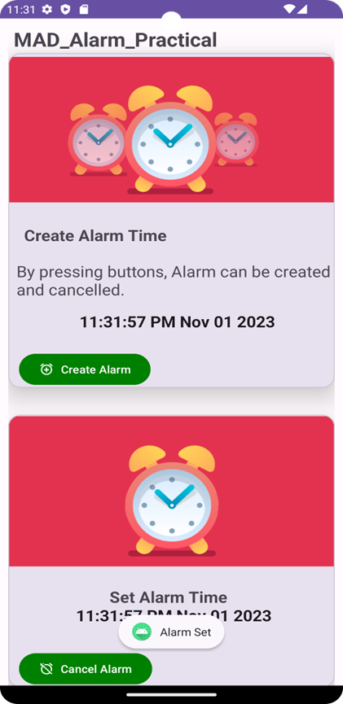

# MAD_P_8_21012011045

## AIM: 

What is BroadcastReceiver? Difference between Service and BroadcastReceiver. Create an Alarm application by using service & BroadcastReceiver by following below instructions.

1. Create MainActivity according to below UI design.

2. Create AlarmBroadcastReceiver class

3. Create AlarmService Class

4. Add android.permission.SCHEDULE_EXACT_ALARM Permission in Manifest file

## Screenshot

